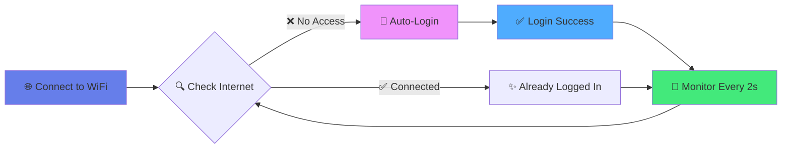

<div align="center">

# 🚀 University WiFi Auto-Login

[](https://www.python.org/)
[](LICENSE)
[](https://www.microsoft.com/windows)
[](https://github.com/abhishekk-y/AutoLogin/stargazers)


### *Never manually login to university WiFi again!*

**Access Made By [Tuskk](https://github.com/abhishekk-y)** 💎

---

</div>

## ✨ Features

<table>
<tr>
<td width="50%">

### ⚡ **Lightning Fast**
- ✅ Checks every **2 seconds**
- ✅ Auto-login in **1-2 seconds**
- ✅ Instant captive portal detection
- ✅ No waiting, no delays

</td>
<td width="50%">

### 🔒 **Secure & Safe**
- ✅ Fernet encryption for credentials
- ✅ Local storage only
- ✅ No data sent to servers
- ✅ Open-source & auditable

</td>
</tr>
<tr>
<td width="50%">

### 🚀 **Set & Forget**
- ✅ One-time password setup
- ✅ Runs on Windows startup
- ✅ Background operation
- ✅ Zero maintenance

</td>
<td width="50%">

### 🎨 **User Friendly**
- ✅ Interactive setup wizard
- ✅ Colored console output
- ✅ Clear status messages
- ✅ Comprehensive logging

</td>
</tr>
</table>

---

## 🎯 How It Works



---

## 🛠️ Installation

### 📋 **Prerequisites**


### ⚙️ **Quick Start** (3 Steps)

<details open>
<summary><b>1️⃣ Clone the Repository</b></summary>

```bash
git clone https://github.com/abhishekk-y/AutoLogin.git
cd AutoLogin
```

</details>

<details open>
<summary><b>2️⃣ Install Dependencies</b></summary>

```bash
pip install -r requirements.txt
```

</details>

<details open>
<summary><b>3️⃣ Run Setup Wizard</b></summary>

```bash
python setup.py
```

Enter your university credentials **once** - they'll be encrypted and saved securely!

</details>

### 🎉 **That's it! You're ready to go!**

---

## 🚀 Usage

### 🖥️ **Manual Start**

**With Console** (for testing):
```bash
python autologin.py
```

**Background Mode** (no window):
```bash
pythonw autologin.py
```

### 🔄 **Auto-Start on Boot**

Right-click **`install_startup.bat`** → **Run as Administrator**

> The service will now run automatically every time you login to Windows!

### 🛑 **Disable Auto-Start**

Right-click **`uninstall_startup.bat`** → **Run as Administrator**

---

## 📊 Console Output

```
============================================================
   University WiFi Auto-Login System
   Access Made By Tuskk
============================================================

✓ Credentials loaded for: 24BCS12988
ℹ Monitoring network status every 2 seconds (instant detection)...
⚠ Press Ctrl+C to stop

[12:30:15] ⚠ Authentication required - Internet not accessible
[12:30:16] ℹ Attempting to login...
[12:30:17] ✓ Login successful! Internet access granted.
[12:30:19] ✓ Already logged in - Internet access active
[12:30:21] ✓ Already logged in - Internet access active
```

---

## ⚙️ Configuration

Edit **`config.py`** to customize:

```python
# Detection speed (seconds)
CHECK_INTERVAL = 2      # How often to check (2 = instant)
REQUEST_TIMEOUT = 2     # HTTP request timeout
RETRY_DELAY = 2         # Delay before retry

# Authentication URL (auto-detected)
LOGIN_URL = "http://172.16.2.1:1000/fgtauth"

# Form fields (customize if needed)
USERNAME_FIELD = "username"
PASSWORD_FIELD = "password"

# Test URLs for connectivity check
TEST_URLS = [
    "http://www.google.com",
    "http://www.microsoft.com",
    "http://www.cloudflare.com"
]
```

---

## 🔒 Security

> [!IMPORTANT]
> **Your credentials are safe!**
> - Encrypted using **Fernet symmetric encryption**
> - Stored locally on your machine only
> - Encryption key stored in `encryption.key`
> - Never transmitted over the internet
> - All sensitive files are gitignored

> [!WARNING]
> **Physical Access Risk**
> Anyone with physical access to your computer could potentially decrypt stored credentials. Keep your device secure!

> [!NOTE]
> **University Policy**
> Ensure automating WiFi login complies with your university's acceptable use policy. This tool is for personal convenience only.

---

## 🐛 Troubleshooting

<details>
<summary><b>❌ "No credentials found" error</b></summary>

**Solution:** Run the setup wizard first:
```bash
python setup.py
```

</details>

<details>
<summary><b>❌ Login fails but credentials are correct</b></summary>

**Solution:** Check form field names in `config.py`. To find them:
1. Open login page in browser
2. Right-click username field → **Inspect**
3. Look for `name="..."` attribute
4. Update `USERNAME_FIELD` and `PASSWORD_FIELD` in `config.py`

</details>

<details>
<summary><b>❌ Auto-start not working</b></summary>

**Solution:**
- Ensure you ran `install_startup.bat` **as Administrator**
- Check Task Scheduler for "AutoWiFiLogin" task
- Verify Python is in your system PATH

</details>

<details>
<summary><b>❌ Script crashes or errors</b></summary>

**Solution:** Check the log file:
```bash
notepad autologin.log
```

</details>

---

## 📁 Project Structure

```
AutoLogin/
├── 📄 autologin.py              # Main application (2s detection)
├── 🔐 credential_manager.py     # Encrypted credential storage
├── ⚙️ config.py                 # Configuration settings
├── 🧙 setup.py                  # Interactive setup wizard
├── 📦 requirements.txt          # Python dependencies
├── 🚀 install_startup.bat       # Enable auto-start
├── 🛑 uninstall_startup.bat     # Disable auto-start
├── 📖 README.md                 # This file
├── 📜 LICENSE                   # MIT License
├── 🙈 .gitignore               # Git ignore rules
└── 📁 assets/
    └── auth_screenshot.png      # Login portal screenshot
```

---

## 🤝 Contributing

Contributions are **welcome**! Here's how you can help:

1. 🍴 Fork the repository
2. 🌿 Create your feature branch (`git checkout -b feature/AmazingFeature`)
3. ✅ Commit your changes (`git commit -m 'Add some AmazingFeature'`)
4. 📤 Push to the branch (`git push origin feature/AmazingFeature`)
5. 🎉 Open a Pull Request

### 💡 **Ideas for Contribution**

- [ ] Linux/macOS support
- [ ] GUI application
- [ ] Multiple network profiles
- [ ] Desktop notifications
- [ ] Browser extension
- [ ] Docker container
- [ ] System tray icon

---

## 📜 License

This project is licensed under the **MIT License** - see the [LICENSE](LICENSE) file for details.

---

## ⚠️ Disclaimer

This tool is provided for **educational and convenience purposes only**.

- ✅ Ensure compliance with your university's IT policies
- ✅ Use responsibly and ethically
- ✅ Protect your computer from unauthorized access
- ❌ Developers are not responsible for policy violations or misuse

---

## 🌟 Show Your Support

If this tool saved you time, **give it a star** ⭐ on GitHub!

[](https://github.com/abhishekk-y/AutoLogin/stargazers)
[](https://github.com/abhishekk-y/AutoLogin/network/members)
[](https://github.com/abhishekk-y/AutoLogin/watchers)

---

## 📞 Contact & Support

**Made with ❤️ by [Tuskk](https://github.com/abhishekk-y)**

*For students tired of manual WiFi login* 🎓

<div align="center">

### ⭐ Star this repo if you find it useful!

[](https://github.com/abhishekk-y/AutoLogin)
[](https://github.com/abhishekk-y/AutoLogin/issues)
[](https://github.com/abhishekk-y/AutoLogin/pulls)

---

**🚀 Never wait for WiFi login again!**

</div>
